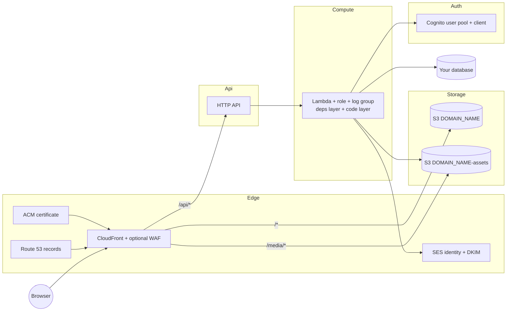

# Elytra

**[Live Preview](https://elytra.shalev396.com)** · [Intro](#intro) · [Getting Started](#getting-started) · [Customize](#customize)

## Intro

Full-stack serverless template on AWS: a React web app, an Express API on a single Lambda, Cognito authentication, Playwright and Postman tests, and CICD that deploys `dev` / `qa` / `main` with AWS CDK. Clone it, give it a domain and a database, push.

- **Frontend** — React 19, TypeScript, Vite, Tailwind, shadcn/ui, Redux Toolkit, React Query, React Router
- **Backend** — Node.js 24, Express on one Lambda (dependencies layer + codebase layer), Sequelize or Mongoose
- **Infrastructure** — AWS CDK, one CloudFormation stack per stage: CloudFront, S3, API Gateway, Lambda, Cognito, SES, Route 53, ACM, optional WAF



### Infrastructure Composer

The complete stack — every resource, its IAM role and policy, log group, API routes and DNS records, boxed into **Edge**, **Api**, **Compute**, **Storage** and **Auth** — is committed as an [AWS Infrastructure Composer](https://docs.aws.amazon.com/infrastructure-composer/latest/dg/what-is-composer.html) drawing: [`server/infra/composer/template.json`](server/infra/composer/template.json).

- **View it:** in VS Code with the [AWS Toolkit](https://marketplace.visualstudio.com/items?itemName=AmazonWebServices.aws-toolkit-vscode), right-click the file → **Open with Infrastructure Composer**.
- **It stays current by itself:** the pre-commit hook regenerates and stages it whenever a staged file is under `server/infra/`, and CI fails if it is stale. To regenerate by hand: `cd server && npm run synth:composer` (no AWS access needed).
- It uses placeholder values (`dev.example.com`, account `123456789012`) and is never deployed. Details in [Infrastructure](docs/infrastructure.md#visualizing-in-infrastructure-composer).

| Docs                                                                                                       | What's inside                                                   |
| ---------------------------------------------------------------------------------------------------------- | --------------------------------------------------------------- |
| [Infrastructure](docs/infrastructure.md)                                                                   | Resources, one-function design, layers, inputs/outputs, cdk-nag |
| [Deployment](docs/deployment.md)                                                                           | Branch → stage, one-time AWS/GitHub setup, troubleshooting      |
| [Staging access](docs/staging-access.md)                                                                   | Locking dev/qa behind a login with WAF                          |
| [Frontend tests](client/tests/README.md) · [API tests](postman/README.md) · [OpenAPI](server/openapi.yaml) | Test suites and API spec                                        |

Questions in [Discussions](https://github.com/shalev396/Elytra/discussions), bugs in [Issues](https://github.com/shalev396/Elytra/issues), code via [CONTRIBUTING](CONTRIBUTING.md), vulnerabilities via [SECURITY](SECURITY.md).

## Getting Started

**You need:** Node.js 22+ (CI uses 24), Python 3 (E2E tests), an AWS account, a Route 53 hosted zone, and a [supported database](docs/infrastructure.md#inputs-and-outputs) (Sequelize: PostgreSQL, MySQL, …; Mongoose: MongoDB, DocumentDB).

### 1. Clone

```bash
git clone https://github.com/shalev396/Elytra.git && cd Elytra
```

Or click **Use this template** on GitHub.

### 2. Configure a stage

[`server/.env.example`](server/.env.example) lists every GitHub secret and variable; the same keys go in `server/.env.<stage>` for local deploys and the local API.

```bash
cp server/.env.example server/.env.dev   # and .env.qa, .env.prod
```

| Name              | GitHub               | Required                                | Description                                                                                                                                        |
| ----------------- | -------------------- | --------------------------------------- | -------------------------------------------------------------------------------------------------------------------------------------------------- |
| `AWS_ACCOUNT_ID`  | repository secret    | CI                                      | Builds the OIDC role ARN                                                                                                                           |
| `AWS_ROLE_NAME`   | repository variable  | CI                                      | Name of the GitHub OIDC role CI assumes                                                                                                            |
| `AWS_REGION`      | repository variable  | no                                      | Stack region, defaults to `us-east-1`                                                                                                              |
| `DOMAIN_NAME`     | environment variable | yes                                     | Stage domain (e.g. `dev.example.com`) inside a Route 53 public hosted zone; also names the S3 buckets                                              |
| `DATABASE_URL`    | environment secret   | yes                                     | `postgres://…` uses Sequelize, `mongodb+srv://…` uses Mongoose                                                                                     |
| `CERTIFICATE_ARN` | repository secret    | only if `AWS_REGION` is not `us-east-1` | ACM certificate in `us-east-1` covering every stage domain. When set it is always used; when unset in `us-east-1`, the stack creates one per stage |
| `WAF_WEB_ACL_ARN` | repository secret    | no                                      | Existing global WAF web ACL to attach to CloudFront                                                                                                |

Nothing account-specific is committed. The account comes from your credentials, the hosted zone is found in Route 53 at deploy time, and Cognito ids and bucket names are read from the deployed stack.

> **Planned:** if `WAF_WEB_ACL_ARN` is not set, the stack will create a web ACL for you. Today it simply deploys without WAF.

### 3. Deploy

One-time per AWS account: `cd server && npx cdk bootstrap aws://<ACCOUNT_ID>/<REGION>`, a GitHub OIDC role, and the GitHub secrets and variables above. Full steps in [Deployment](docs/deployment.md).

Then push `dev`, `qa` or `main`: CICD deploys the stack, syncs the database schema and publishes the frontend. CI only runs the Node scripts in [`server/scripts`](server/scripts), so a manual deploy is the same two commands:

```bash
aws sso login                        # any credentials for the account
cd server && npm install && (cd ../client && npm install)
npm run deploy:backend -- dev        # stack + database schema (dev, qa or prod)
npm run deploy:frontend -- dev       # client to S3 + CloudFront invalidation
```

### 4. Run locally

The local API is the same Express app the Lambda runs, wired to the deployed stage, so it needs AWS credentials and a deployed `dev` stack.

```bash
cd server && npm run dev   # API on http://localhost:3000
cd client && npm install && npm run dev   # app on http://localhost:5173
```

### 5. Test

```bash
cd server && npm run test:unit                          # server unit tests (node:test)
cd server && npm run test:infra && npm run test:local   # infra assertions + Postman API tests
cd client && npm run test:install && npm run test       # Playwright E2E
```

> [!WARNING]
> The E2E suite **wipes the stage the API is bound to** (database, S3 uploads, Cognito users) at the start of every run: `dev` with `npm run dev`, `qa` with `--stage qa` or `npm run test:qa`. Read [Frontend tests](client/tests/README.md) before running it.

PRs to `qa` run local tests; PRs to `main` run tests against live qa.

The pre-commit hook (Husky) formats and lints only the staged files (Prettier, then each package's ESLint), and regenerates the Infrastructure Composer drawing only when `server/infra/` changes. Type checks and builds run in CI.

## Customize

Single sources of truth — change these and names propagate everywhere.

| What                               | Where                                                                                                                                                                                                        |
| ---------------------------------- | ------------------------------------------------------------------------------------------------------------------------------------------------------------------------------------------------------------ |
| App identity, URLs, emails, social | [`client/src/data/app.ts`](client/src/data/app.ts)                                                                                                                                                           |
| Title and description metadata     | [`client/src/data/defaultMetadata.ts`](client/src/data/defaultMetadata.ts)                                                                                                                                   |
| Logo and assets                    | [`client/src/data/assets.ts`](client/src/data/assets.ts)                                                                                                                                                     |
| Favicon                            | `client/public/favicon-light.svg`, `favicon-dark.svg` ([paths](client/src/data/favicon.ts))                                                                                                                  |
| Stack and resource names           | `APP_NAME`, `APP_DISPLAY_NAME` in [`server/infra/lib/constants.ts`](server/infra/lib/constants.ts) (also the `Project` tag; scripts and workflows derive everything from it)                                 |
| Verification email                 | [`server/email-templates/cognito-verification.html`](server/email-templates/cognito-verification.html)                                                                                                       |
| QA URLs for API tests              | [`postman/environments/Elytra QA.environment.yaml`](postman/environments/Elytra%20QA.environment.yaml) and the collection's [`definition.yaml`](postman/collections/Elytra%20API/.resources/definition.yaml) |
| API spec domain                    | `servers[1].variables.domain.default` in [`server/openapi.yaml`](server/openapi.yaml)                                                                                                                        |
| E2E test URLs                      | `BASE_URL` / `API_BASE_URL` env vars ([Frontend tests](client/tests/README.md))                                                                                                                              |

Also update the Live Preview link at the top of this README. Keep `app.name` in `app.ts` aligned with `APP_DISPLAY_NAME` for consistent branding and translations.
