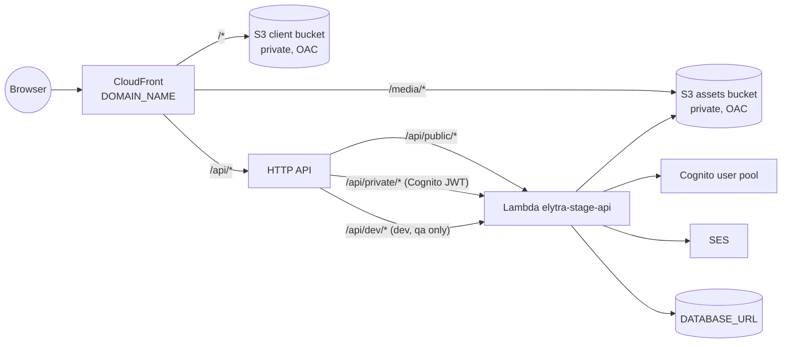

# Infrastructure

[← Back to main README](../README.md) · [Deployment](deployment.md) · [Staging access](staging-access.md)

Elytra's AWS infrastructure is an [AWS CDK](https://docs.aws.amazon.com/cdk/) (TypeScript) app in [`server/infra`](../server/infra). It synthesizes one CloudFormation stack per stage — `elytra-dev`, `elytra-qa`, `elytra-prod` — each fully independent.

## Request flow

## Resources (one stack, ~30 resources)

| Construct ([`infra/lib/constructs`](../server/infra/lib/constructs)) | Creates                                                                                                                                                                                |
| -------------------------------------------------------------------- | -------------------------------------------------------------------------------------------------------------------------------------------------------------------------------------- |
| `Storage`                                                            | Client bucket `DOMAIN_NAME` (Vite build) and assets bucket `DOMAIN_NAME-assets` (`media/` uploads). Both block all public access; CloudFront reads them through origin access control. |
| `Email`                                                              | SES domain identity for `DOMAIN_NAME`, its three DKIM CNAME records, and the deploy-time wait until SES has verified them (see below).                                                 |
| `Api`                                                                | HTTP API with routes `/api/public/{proxy+}`, `/api/private/{proxy+}` (Cognito JWT authorizer) and `/api/dev/{proxy+}` (dev/qa only), throttled 100/200.                                |
| `Edge`                                                               | ACM certificate (imported or created), optional WAF attachment, CloudFront distribution, SPA rewrite CloudFront Function, Route 53 alias record.                                       |
| `Auth`                                                               | Cognito user pool (email sign-in, SES sender `authenticator@DOMAIN_NAME`) and app client.                                                                                              |
| `Compute`                                                            | **One** Lambda function, **one** dependencies layer, **one** codebase layer, its log group (30 days) and least-privilege role.                                                         |

Besides the API function, the stack creates exactly one helper: the SES verification wait below. No auto-delete, log-retention or other custom resources. [`infra/test/stack.test.ts`](../server/infra/test/stack.test.ts) fails if another one appears.

### Why one function

Auth is verified inside the app (`expressAuth`), and API Gateway attaches its JWT authorizer per route, not per function — so a single function serves every route with the same protection. One function means one warm pool (public traffic keeps logged-in requests warm), one role, one log group and one deploy artifact. The backend deploy's schema sync is a direct invoke of the same function with `{"action":"sync-db"}`, an event API Gateway can never produce.

Splitting public/private later is ~10 lines (second `lambda.Function` on the same layers, second integration) if you want a public function without S3/SES/Cognito-admin permissions or separate reserved concurrency.

### Layers

| Piece              | Built by                                                          | Contents                                       | Mounted at                  |
| ------------------ | ----------------------------------------------------------------- | ---------------------------------------------- | --------------------------- |
| Dependencies layer | `npm ci --omit=dev` from `server/package-lock.json`               | production `node_modules` (~45 MB)             | `/opt/nodejs/node_modules`  |
| Codebase layer     | esbuild bundle of `src/lambda.ts`, every package left external    | the whole API in one `index.mjs` (~30 KB)      | `/opt/nodejs/app/index.mjs` |
| Function asset     | committed [`server/lambda/index.mjs`](../server/lambda/index.mjs) | one line: `export { handler } from '/opt/...'` | function root               |

Both layers are built by [`scripts/build-layers.ts`](../server/scripts/build-layers.ts) into `server/.build/layers`. Node resolves the bundle's imports from the parent `node_modules` folder, so no `NODE_PATH` is needed. Asset hashes come from content, so a deploy only publishes a new dependencies layer when production dependencies change. [`scripts/verify-layers.ts`](../server/scripts/verify-layers.ts) merges both layers outside the repo and imports the handler to prove every import links before anything is deployed.

## Inputs and outputs

**Inputs (per stage):**

| Input             | Required                           | Notes                                                                                                          |
| ----------------- | ---------------------------------- | -------------------------------------------------------------------------------------------------------------- |
| `DOMAIN_NAME`     | yes                                | Must sit inside a Route 53 public hosted zone; also the client bucket name (`<DOMAIN_NAME>-assets` for assets) |
| `DATABASE_URL`    | yes                                | NoEcho CloudFormation parameter (see below)                                                                    |
| `AWS_REGION`      | no — defaults to `us-east-1`       | Region of the whole stack                                                                                      |
| `CERTIFICATE_ARN` | only if `AWS_REGION` ≠ `us-east-1` | ACM certificate for `DOMAIN_NAME`, always in `us-east-1`. Used as-is whenever it is set                        |
| `WAF_WEB_ACL_ARN` | no                                 | Existing global (CloudFront scope) web ACL to attach; no WAF when unset                                        |

Certificate rule, checked before synth: `CERTIFICATE_ARN` set → use it (it must be a `us-east-1` ACM ARN). Not set → the stack creates and DNS-validates one, which is only possible when the stack itself is in `us-east-1`; any other region fails with an explanation.

Planned: when `WAF_WEB_ACL_ARN` is not set, the stack will create a web ACL for you. Not implemented yet.

| Derived value     | How                                                                                                                                                                                                                                                          |
| ----------------- | ------------------------------------------------------------------------------------------------------------------------------------------------------------------------------------------------------------------------------------------------------------ |
| Account           | From the deploying AWS credentials                                                                                                                                                                                                                           |
| Hosted zone       | Found in Route 53 by `npm run deploy:backend` at run time: the public zone named `DOMAIN_NAME` or its closest parent (works for `dev.app.example.co.uk`). Passed as `-c hostedZoneId` / `-c hostedZoneName`; never cached in `cdk.context.json` (gitignored) |
| Database provider | From the URL scheme: `mongodb://` / `mongodb+srv://` → Mongoose, otherwise Sequelize                                                                                                                                                                         |
| Cognito ids       | Set on the function by CDK; read from stack outputs locally                                                                                                                                                                                                  |
| Dev tools         | On for dev/qa, off for prod                                                                                                                                                                                                                                  |

`DATABASE_URL` is passed at deploy time as a **NoEcho CloudFormation parameter**, so it never appears in the template, `cdk diff` or `describe-stacks`.

**Outputs — one per consumer:**

| Output                                 | Read by                                                     |
| -------------------------------------- | ----------------------------------------------------------- |
| `S3ClientBucketName`                   | CI frontend upload                                          |
| `CloudFrontDistributionId`             | CI cache invalidation                                       |
| `ApiFunctionName`                      | CI database schema sync                                     |
| `CognitoUserPoolId`, `CognitoClientId` | Local API server ([`src/local.ts`](../server/src/local.ts)) |
| `S3AssetsBucketName`                   | Local API server                                            |

## Waiting for SES before Cognito

Cognito rejects an SES sender whose domain identity is not verified yet, and SES verifies a new domain some time after its DKIM records appear (usually minutes; 44 minutes has been seen). The stack waits for it, so the first deploy of a stage behaves like every other deploy:

1. `Email/VerificationCheck` (custom resource, after the identity and DKIM records) starts a background check in [`infra/functions/ses-domain-verification`](../server/infra/functions/ses-domain-verification/index.mjs) and returns immediately.
2. The check polls SES every 30 seconds, handing over to a fresh Lambda invocation every 15 minutes, and signals the `Email/DomainVerified…` **WaitCondition** once SES reports the domain verified.
3. The WaitCondition (timeout 12 hours, the CloudFormation maximum) is what the user pool depends on.

Later deploys do not wait again: nothing in the chain changes. The WaitCondition's logical ID includes a hash of `DOMAIN_NAME`, so changing the domain creates a new wait for the new identity. If SES never verifies (for example, broken DKIM records), the check signals a failure with the reason instead of timing out silently.

## Tags

Tagging is app-wide and automatic: [`infra/lib/tags.ts`](../server/infra/lib/tags.ts) is called once on the CDK app and tags the stack and every resource that can carry tags — including any resource you add later — with exactly two tags, and nothing else (the `Name` tags some CDK constructs add are removed). No construct tags anything itself.

| Key       | Value                 |
| --------- | --------------------- |
| `Project` | `APP_NAME` (`elytra`) |
| `Stage`   | `dev`, `qa` or `prod` |

CloudFormation cannot tag bucket policies, Route 53 records, API routes, integrations and authorizers, Lambda permissions and layer versions, the origin access control, the user pool client, the IAM inline policies, the SES verification custom resource, or the WaitCondition and its handle. [`infra/test/stack.test.ts`](../server/infra/test/stack.test.ts) fails if any other resource is missing a tag or has an extra one.

**Billing.** CloudFormation cannot activate cost allocation tags (it is an account-wide billing setting), so `npm run deploy:backend` activates `Project` and `Stage` through the Cost Explorer API after every deploy. It never fails a deploy: keys billing has not seen yet (up to a day after the first tagged resources exist) are activated on a later deploy, and in an AWS Organizations member account only the management account can activate them. Then filter or group by `Project` and `Stage` in Cost Explorer.

## Per-stage protection

| Setting                       | dev / qa | prod     |
| ----------------------------- | -------- | -------- |
| `/api/dev/*` route + router   | yes      | no       |
| Assets bucket on stack delete | deleted  | retained |
| User pool on stack delete     | deleted  | retained |
| User pool deletion protection | off      | on       |
| Stack termination protection  | off      | on       |

Buckets are never auto-emptied; empty them before deleting a stack.

## cdk-nag

Every synth runs the [cdk-nag](https://github.com/cdklabs/cdk-nag) AwsSolutions pack; any unacknowledged finding fails synth (and `npm run test:infra`). Acknowledgements live in [`infra/lib/nag.ts`](../server/infra/lib/nag.ts), each scoped to one construct with its reason: no access logs (S1, APIG1, CFR3), public auth routes and dev routes (APIG4), no geo restriction (CFR1), no WAF when `WAF_WEB_ACL_ARN` is unset (CFR2), Essentials tier and no MFA (COG8, COG2), `AWSLambdaBasicExecutionRole` (IAM4), and the prefix-scoped `media/*` and condition-scoped SES `identity/*` statements (IAM5).

## Commands (`cd server`)

| Command                              | Needs AWS? | What it does                                                                                                             |
| ------------------------------------ | ---------- | ------------------------------------------------------------------------------------------------------------------------ |
| `npm run dev`                        | yes        | Local API on :3000 against the `elytra-dev` stack (also `qa`, `prod`)                                                    |
| `npm run build`                      | no         | Typecheck `src/`, `infra/`, `scripts/`                                                                                   |
| `npm run test:infra`                 | no         | Synth all stages with fixture values, assertions, cdk-nag, Composer drawing                                              |
| `npm run build:layers`               | no         | Build both Lambda layers                                                                                                 |
| `npm run verify:layers`              | no         | Prove the layers link                                                                                                    |
| `npm run synth`                      | no         | `cdk synth` of `elytra-dev` with fixture values                                                                          |
| `npm run synth:composer`             | no         | Write the Infrastructure Composer drawing (below)                                                                        |
| `npm run deploy:backend -- <stage>`  | yes        | Guard, find the hosted zone, build + verify layers, `cdk deploy`, sync the database schema ([Deployment](deployment.md)) |
| `npm run deploy:frontend -- <stage>` | yes        | Build the client, upload it to the client bucket, invalidate CloudFront                                                  |

## Visualizing in Infrastructure Composer

[`server/infra/composer/template.json`](../server/infra/composer/template.json) is committed. In VS Code with the AWS Toolkit, right-click it → **Open with Infrastructure Composer**.

It is regenerated by [`scripts/composer-template.ts`](../server/scripts/composer-template.ts) (`npm run synth:composer`) from a fixture synth of the dev stack, so it needs no credentials and contains no real account, domain or zone. The pre-commit hook runs it and stages the file whenever `server/` changes, and `npm run test:infra` (CI) fails if the committed file is stale.

What the drawing contains ([`infra/lib/composer.ts`](../server/infra/lib/composer.ts)):

- **Every resource of the real stack** with its real type and properties: buckets and bucket policies, SES identity and DKIM records, the HTTP API with its stage, routes, integration, authorizer and invoke permissions, certificate, origin access control, SPA rewrite function, distribution, alias record, user pool and client, both layers, the function with its log group, and its IAM role and policy.
- **Readable names** from the construct path without the top-level construct: `ClientBucket`, `FunctionServiceRole`, `ServiceRoleDefaultPolicy`, `PublicRoute`.
- **Group boxes:** **Edge** (DNS records, certificate, CloudFront, SES), **Api**, **Compute**, **Storage**, **Auth**.
- Composer nests some resources inside another card (routes, integration, authorizer and permissions in the `HttpApi` card; the log group in the `Function` card; the policy in the role card; bucket policies in their bucket).

Two Composer limitations are worked around, only in the drawing: its CloudFront card draws only the first S3 origin, so the API, certificate and origin access control carry a tag or description referencing the distribution to get their connection line (the assets bucket cannot be drawn connected to CloudFront); and its S3 card rejects dotted bucket names, so they are written as `Fn::Join`. The file is formatted exactly as Composer saves it, so opening it does not modify it.

The drawing is not deployable — deploys always use the real template in `server/cdk.out`.

## Renaming the app

`APP_NAME` / `APP_DISPLAY_NAME` in [`infra/lib/constants.ts`](../server/infra/lib/constants.ts) name the stacks and resources. Workflows and scripts derive the stack name from it, so nothing else needs to change.
